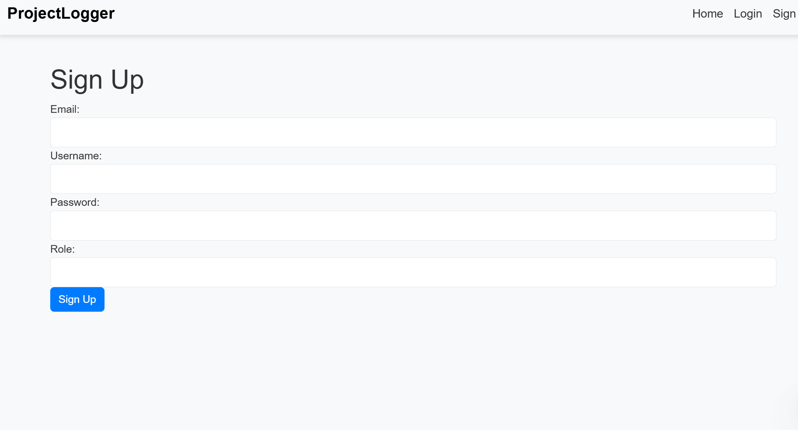
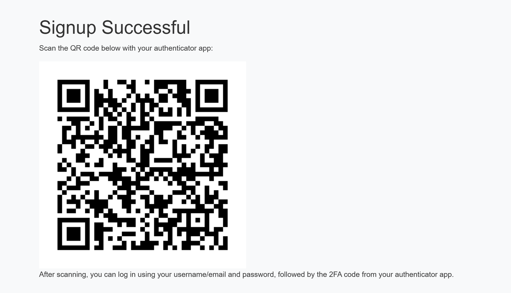
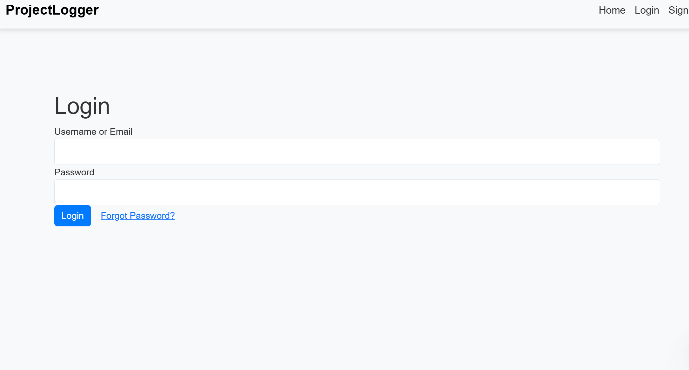
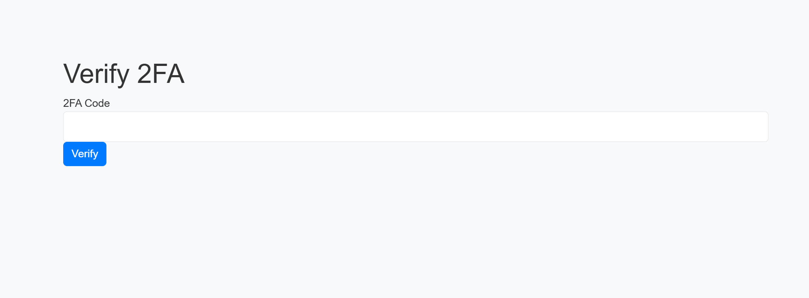

# Logging App

This project is a **Logging Application** that includes:

- ✅ **CSRF Protection**
- ✅ **Brute Force Mitigation**
- ✅ **Two-Factor Authentication (2FA) with Google Authenticator**
- ✅ **Secure Data Storage with SQLite**
- ✅ **Proper Input Validation and XSS Prevention**

---

⚠ **IMPORTANT: You must sign up yourself**  
This system uses **Two-Factor Authentication (2FA)**, which generates a unique authentication code for each user.  
A working username and password **cannot be provided**, as the 2FA code is linked to your personal device.  
Please follow the **Sign Up** process below to create your own account.

## **Installation & Setup**

### **1. Install Dependencies**

Make sure Python is installed, then install all necessary dependencies:

```sh
pip install -r requirements.txt
```

### **2. Start the Application**

Run the following command to start the Flask server:

```sh
python main.py
```

---

## **User Registration & Login Process**

### **Step 1: Sign Up**

1. Start the application and **navigate to the Sign Up page**.
2. Fill in your **username, email, password, and confirm your password**.
3. Click the **"Sign Up"** button.
4. A **QR code** will be displayed on the screen.

**Screenshot of the Signup Page with QR Code**  


---

### **Step 2: Enable Two-Factor Authentication (2FA)**

1. Open the **Google Authenticator** app on your phone.
2. Click **"Scan a QR Code"** and scan the QR code shown after signing up.
3. A **6-digit authentication code** will now be generated in your app.

**Screenshot of Google Authenticator with the Scanned Code**  


---

### **Step 3: Login**

1. **Navigate to the Login page** through the buttons in the app.
2. Enter your **username or email** and **password**.
3. Click the **"Login"** button.
4. A **2FA code prompt** will appear.
5. Open **Google Authenticator**, retrieve your 6-digit code, and enter it.
6. Click **"Verify"** to access your account.

📸 **Screenshot of Login Page**  


📸 **Screenshot of 2FA Input Page**  


---

## 🔐 **Security Features**

- **CSRF Protection** – Ensures secure form submissions.
- **Brute Force Prevention** – Blocks excessive login attempts.
- **2FA via Google Authenticator** – Adds an extra layer of security.
- **SQL Injection & XSS Mitigation** – Uses input sanitization and prepared statements.
- **Session Management** – Uses Flask sessions to track authentication securely.

---

## **User Accessibility Testing (UAT)**

This project was tested for accessibility, including:

- ✅ **Keyboard Navigation** – Fully accessible login and signup forms.
- ✅ **Form Validation** – Proper error messages and validation checks.
- ✅ **Responsive Design** – Works across different screen sizes.
- ✅ **Color Contrast Check** – Verified using browser DevTools.

---

---

---

```

```
